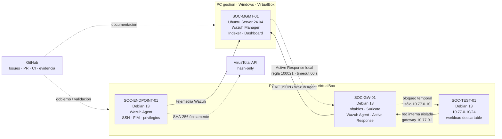

# Mini-SOC Lab — Arquitectura implementada

> Estado: arquitectura v1 implementada y validada. Este documento describe el entorno real; no es un diseño futuro.



## Trust boundaries y flujos

| Límite / flujo | Control |
| --- | --- |
| SOC-TEST-01 → SOC-GW-01 | Segmento interno VirtualBox aislado; TEST no tiene NIC NAT/bridged |
| Forwarding TEST → exterior | nftables con política forward default-deny, flujo mínimo autorizado y NAT |
| Suricata → Wazuh | EVE JSON local ingerido por Wazuh Agent en SOC-GW-01 |
| Endpoint/Gateway → Manager | Wazuh sobre conectividad bridged dedicada; NAT conserva la ruta por defecto |
| Wazuh → Active Response | Regla específica 100021, ejecución local en GW, allowlist exacta y timeout |
| Laboratorio → VirusTotal | Sólo SHA-256; no se sube el artefacto y la API key no se persiste |
| Administración SSH de VMs | Port forwards de VirtualBox restringidos a loopback cuando aplican |
| GitHub → laboratorio | GitHub gobierna scripts/documentación/CI; las VMs son runtime/UAT |

## Detection-to-response

```text
Actividad autorizada en SOC-TEST-01
        ↓
Suricata en SOC-GW-01
        ↓  SID 1000001
EVE JSON
        ↓
Wazuh Agent (GW)
        ↓
Wazuh Manager / regla nativa 86601
        ↓
regla local específica 100021
        ↓
Active Response local
        ↓
tabla runtime nftables mini_soc_ar
        ↓
bloqueo temporal de 10.77.0.10
        ↓  timeout 60 s
DELETE automático → recuperación
```

La prueba end-to-end de CHG-021 confirmó el ciclo completo sin modificar el ruleset persistente del gateway.

## Fuentes de verdad

- NetworkManager: red de SOC-GW-01.
- `/etc/network/interfaces`: red de SOC-TEST-01.
- Netplan: red de SOC-MGMT-01.
- configuración Debian de interfaces: SOC-ENDPOINT-01.
- `/etc/nftables.conf`: firewall/routing persistente del gateway.
- Wazuh Manager: correlación y Active Response.
- GitHub: historial de cambios, scripts reproducibles y documentación pública sanitizada.

No se mantienen configuraciones paralelas para resolver problemas de una capa distinta.

## Decisiones de seguridad

La arquitectura privilegia separación de responsabilidades y cambios proporcionales al riesgo. El gateway usa nftables como única tecnología de firewall; CHG-021 evitó instalar iptables sólo para reutilizar una respuesta preexistente de Wazuh. La respuesta automática está limitada al workload de prueba, tiene rollback temporal y no alcanza el camino administrativo.

Suricata funciona como NIDS y Wazuh como plataforma central de observación/correlación. YARA cubre detección local de archivos y VirusTotal sólo aporta enriquecimiento externo por hash. Un match técnico no se presenta automáticamente como incidente: el triage y la disposición siguen siendo decisiones analíticas.

## Limitaciones deliberadas

Esta v1 no representa un SOC productivo. Alta disponibilidad, backups/restore operativos, retención dimensionada, multi-tenancy, SLA, operación 24×7, gestión empresarial de secretos y hardening adicional de las interfaces bridged quedan fuera del alcance actual.

El Active Response es runtime-only y fail-open ante un reload del ruleset persistente de nftables. Esa propiedad está aceptada para una contención temporal de laboratorio y requeriría otro diseño para producción.

## Evidencia relacionada

Los documentos `docs/CHG-017.md` a `docs/CHG-021.md` contienen la evolución desde NIDS hasta detección, enriquecimiento y respuesta. El README resume el estado del proyecto para una primera lectura de portfolio.
